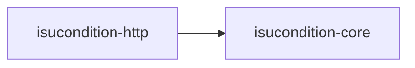
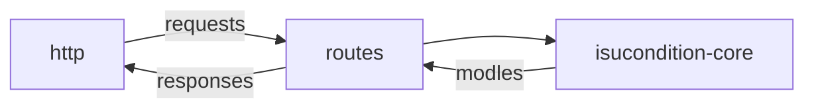
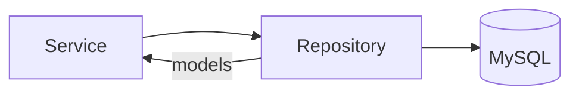

# What is this

Writing a sample of [axum](https://github.com/tokio-rs/axum) application base on [isucon/isucon11-qualify](https://github.com/isucon/isucon11-qualify) for my study purpose.

# How to run test

```
$ ln -s docker-compose.override.yml.example docker-compose.override.yml
$ docker-compose up -d
$ MYSQL_DBNAME=isucondition_test ./sql/init.sh
$ cargo test --workspace -- --test-threads=1 --nocapture
```

# Architecture Overview



## isucondition-http
handle http request using axum.

use isucondition-core API.
convert isucondition-core response to responses object.




## isucondition-core
core application API. don't handle HTTP

see [cargo doc](https://walf443.github.io/isucon11-qualify-rust-axum/isucondition_core/) for more detetails.



